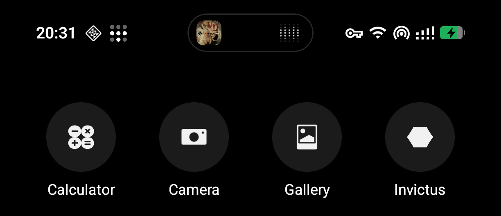
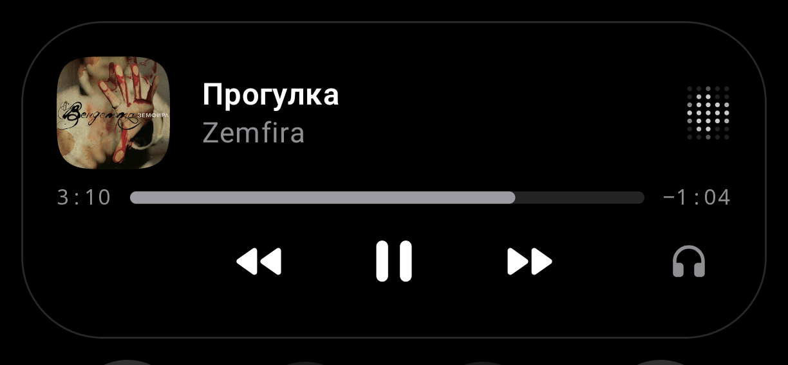
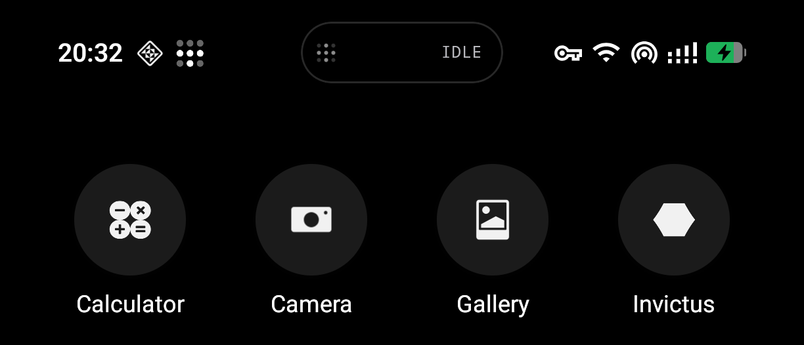

<h1 align="center">Dot Island</h1>

<p align="center">
  A personal Android overlay that turns <strong>Spotify</strong>, <strong>Dodo Pizza orders</strong> and
  <strong>phone calls</strong> — plus anything you publish through its API — into one
  monochrome island around the camera.
</p>

<p align="center">
  <strong>v0.0.2</strong> · <code>dev.qarasky.dotisland</code> · single-device build (Nothing A069, Android 16)
</p>

<p align="center">
  
  
  
  
  
</p>

---

## Screenshots

<p align="center">
  
  
  
</p>

<p align="center">
  <em>Collapsed music pill · expanded music card · idle</em>
</p>

---

## What it is

One pill morphs into one card. No settings maze, no color studio, no second
notification shade — ordinary notifications stay in the system shade, untouched.
The island only ever shows ongoing activities:

| Source | Collapsed | Expanded |
| --- | --- | --- |
| **Spotify** | Artwork + dot-matrix activity | Squircle artwork, title/artist, seek bar with remaining-time countdown, prev/play/next, audio-output shortcut |
| **Dodo Pizza** (`ru.dodopizza.app`) | `ORDER` + ETA when the notification states one | Order text, source ETA/progress only — nothing invented |
| **Calls** | `CALL` / live timer | Answer / decline |
| **Published (API)** | Publisher icon + `%` or `API` | Title, text, optional progress bar |
| **Idle** | Standby dot matrix + `IDLE` | — (idle never expands; the dots do a brief wink every ~9 s) |

Monochrome throughout: black surfaces, white glyphs, system monospace for times,
readable sans for names. Original artwork keeps its colors.

## Gestures

| Gesture | Action |
| --- | --- |
| Single tap | Open the source app |
| Hold | Expand while the finger is down (light 12 ms haptic) |
| Outside tap | Collapse |
| Swipe up / hold + swipe up | Dismiss current / dismiss all |

## Publishing API

Any app — or `adb`, Termux, Tasker — can put an activity in the island:

```bash
adb shell am broadcast -a dev.qarasky.dotisland.action.PUBLISH \
  --es id "com.android.shell:job1" \
  --es title "Build finished" \
  --es text "12 tests, 0 failures"
```

Caller identity comes from `Binder.getCallingUid()`, checked against an
allowlist in the app — a publisher can't impersonate another app.
`com.android.shell` is allowed by default. Activities expire on their own
(default 30 min) so a crashed publisher can't leave a permanent entry.
Full contract: [`docs/PUBLISHING_API.md`](docs/PUBLISHING_API.md).

---

## Permissions

| Permission | Why |
| --- | --- |
| Accessibility service | Draw the overlay and detect the foreground app |
| Notification listener | Read Spotify / Dodo / call notifications (never cancels or re-sounds them) |
| `FOREGROUND_SERVICE` + `RECEIVE_BOOT_COMPLETED` | Keep the island alive, restore after reboot |
| Battery-optimization exemption | Same reason |
| `VIBRATE` | The 12 ms expansion pulse |

No `INTERNET`, no usage-stats, no Bluetooth scanning, no Shizuku. The
accessibility service declares window-state events only and never reads screen
content.

---

## Build & install

```bash
./gradlew assembleDebug
adb install -r app/build/outputs/apk/debug/app-debug.apk
```

Then open **Dot Island**, grant accessibility + notification access, exempt it
from battery optimization, and flip the switch. Verification (serial — parallel
lint hits a tool bug, so CI-style runs use `--no-parallel --max-workers=1`):

```bash
./gradlew assembleDebug testDebugUnitTest lintDebug --no-parallel --max-workers=1
```

---

## Docs

- [`docs/PERSONAL_BUILD.md`](docs/PERSONAL_BUILD.md) — scope, policy, verification log
- [`docs/PUBLISHING_API.md`](docs/PUBLISHING_API.md) — broadcast contract, rules
- [`docs/ISLAND_STYLE.md`](docs/ISLAND_STYLE.md) — motion, geometry, 120 Hz notes
- [`CHANGELOG.md`](CHANGELOG.md) — history (pre-rebrand entries keep the old name)

---

## License

Dot Island is licensed under the [GNU General Public License v3.0](LICENSE).

Copyright (C) 2026 **Animesh Gupta**. This project began as a fork of
[`agupta07505/SmartIsland`](https://github.com/agupta07505/SmartIsland) and was
rebuilt as a personal single-device app. Per GPL-3.0 Sections 4 and 5, original
authorship credit is retained in every source file, all modifications are likewise
GPLv3, and redistribution must offer the corresponding source.
